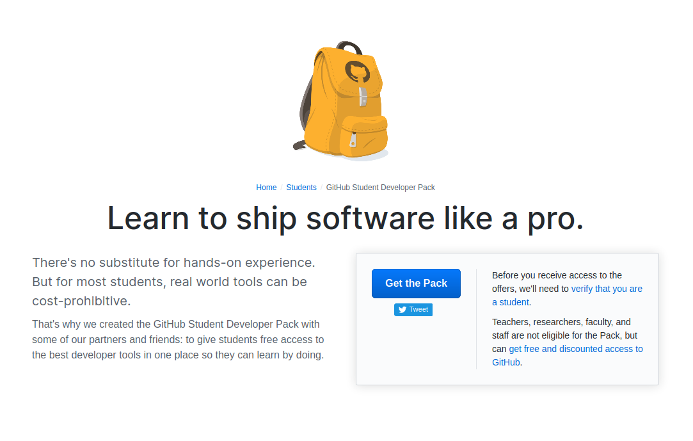
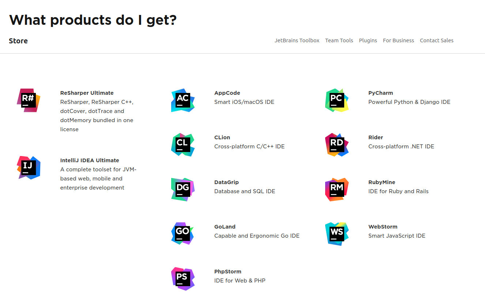
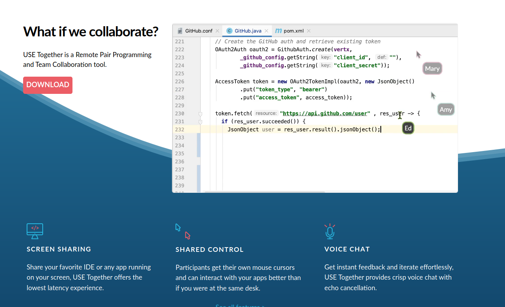

¿Sabias que, si sos alumno de una universidad (o incluso colegio secundario), y tenes documentos que lo pruebe, podes acceder a un MONTON de beneficios para developers? Si, GitHub Student Developer Pack viene cargadisimo de cositas gratis para ayudarte con tus proyectos, a probar nuevas tecnologias y cosas que se usan en el mercado laboral. Aca te voy a mostrar como acceder, y cuales son los mejores beneficios.

## Acceso

Los requisitos, segun [GitHub](https://help.github.com/en/github/teaching-and-learning-with-github-education/applying-for-a-student-developer-pack), son los siguientes:

- Estar anotado en un curso que te garantice un diploma: escuela secundaria / preparatoria, universidad, o instituciones similares.
- Tener un email escolar verificable (uno con dominio .edu o similar), o documentos que prueben tu status de estudiante.
- Tener una cuenta de GitHub.
- Tener al menos 13 años.

Si tu institucion no te da un mail .edu, GitHub te permite adjuntar documentos como certificados de alumno regular, o alguna credencial o ID de estudiante. Mi universidad me provee con un mail de dominio *.edu.ar*, y no tuve ningun problema para registrarme y acceder a los beneficios.

Para ello, debemos ir a [education.github.com](https://education.github.com/), clickear donde dice *Get benefits*, y seguir los pasos. Si tienes un mail universitario, probablemente no tarden nada en aprobarte el registro. Si, por el contrario, envias documentos como prueba, quizas tarden un poco mas.

### Renovacion
El acceso al pack expira un año despues de tu registro, pero puedes renovarlo nuevamente, siempre y cuando sigas cumpliendo los requisitos.

## Beneficios

Resumidamente, viene con de todo. Un montonazo de productos, algunos muy distintos entre si, otros que se parecen, pero con variaciones en lo que te traen: algunos dan credito para su plataforma, otros licencias por 3, 6, 12 meses, o una combinacion de ambas. Otros se ponen verdaderamente la 10, y ofrecen licencias que se renuevan cada año, mientras tengas activado el pack - osea, mientras seas estudiante.

## Contenido

Con mas de 100 ofertas, es dificil resumir todo en un articulo. Por eso, destacare algunos de los mejores, y para verlos todos podran referirse a la lista interactiva al final del texto.

#### JetBrains

JetBrains es la empresa detras de varios IDEs muy conocidos, como IntelIJ y PyCharm. Mientras seas estudiante, tendras acceso a todos sus productos, incluyendo IntelIJ IDEA Ultimate, ReSharper Ultimate, entre otros, utilizando practicamente cualquier lenguaje de programacion que se te ocurra. Link a la oferta.

#### USETogether

USETogether es una herramienta dedicada 100% al pair-programming: pantalla compartida, control compartido y chat de voz permiten a dos personas trabajar en un mismo proyecto al mismo tiempo, en la misma pantalla, como si estuvieran sentados juntos. Super util para proyectos de clase y para sesiones de mentoreo.

#### Name.com + Heroku

Si bien estos dos son ofertas distintas, los puse juntos porque son todo lo que necesitas para poder desplegar ese proyecto web que tenes guardado en lo profundo de GitHub: Name.com ofrece un año de dominio y certificado SSL gratis, mientras que Heroku permite hostear durante 2 años tu aplicacion en uno de sus espacios Hobby, su linea mas basica. Eso si, no esperes un .com, dado que los dominios disponibles no son los mas populares. De todas formas, un .ninja es mejor que nada!

#### Cursos

Esto es mas una categoria que un producto, pero con 12 plataformas distintas de cursos, era dificil decidir. Con duraciones que van desde las 2 semanas hasta el año, y topicos desde programacion front-end hasta preparacion para entrevistas tecnicas, hay mucho valor aca, dependiendo de que quieras aprender y con que nivel empieces. Entre todos, la licencia con mas duracion es la de Go Rails, de maximo un año, con tutoriales de Ruby on Rails, JavaScript y demas. Otro de los mas interesantes es Covalence, que incluye un mes de su plan Atomic, ademas de 2 sesiones de mentoreo 1-on-1.

Dentro de los diseñados para principiantes esta Thinkful, que ofrece su curso de introduccion al desarrollo front-end, de dos semanas de duracion, gratis a los que posean el pack de GitHub.

## Conclusion

Hay muchisimo valor para extraer de este pack. Si eres estudiante y puedes probarlo, no perdes nada en solicitar los beneficios, y es segurisimo que alguno te va a servri para comenzar ese proyecto que tenias en mente, o para darle un empujon o hacerle una mejora a uno que ya tenias armado.

En esta [lista](https://education.github.com/pack) se encuentran todos los beneficios.
